OOP
===
# Базовые принципы проектирования

## Принципы SOLID

### S - single responcibility

> У класса должен быть только один мотив для изменения

Класс не должен реализовывать логику разных процессов. Класс должен отвчать **только** за одну часть функциональности программы.  Если это не так, стоит разбить класс на части.  

**Пример**:  
Класс Emploee обладает несвязными поведениями. 

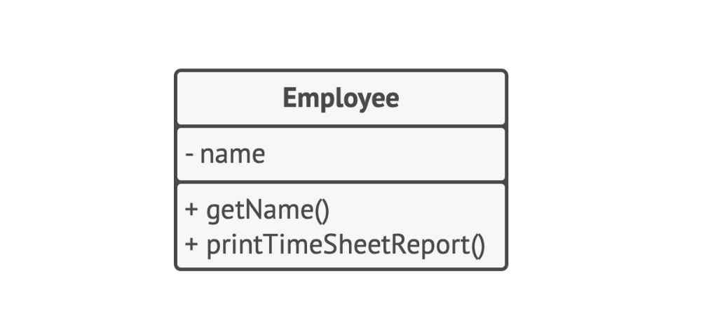

Проблема решается, если вынести печать отчета в отдельный класс

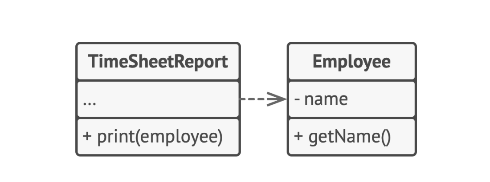


### O - open/closed

> Расширяйте классы, но не изменяйте их первоначальный код

Этот принцип пропогандирует, чтобы классы были открыты для расширения, но закрыты для изменения. Идея заключается в том, чтобы не ломать существующий клиентский код, ввода дополнительное поведение у умеющейся логики.  
Класс можно назвать открытым, если он доступен для расширения. Мы можем расширить его функционал, унаследовав его и добавив новые поля.  
Класс называется закрытым, если он готов к применению другими классами и не будет изменяться в будущем.  

**Пример**:
Объект `Order` имеет метод расчета стоимости доставки, который вшит в класс и его будет тяжело расширять, придется трогать "закрытый" код класса

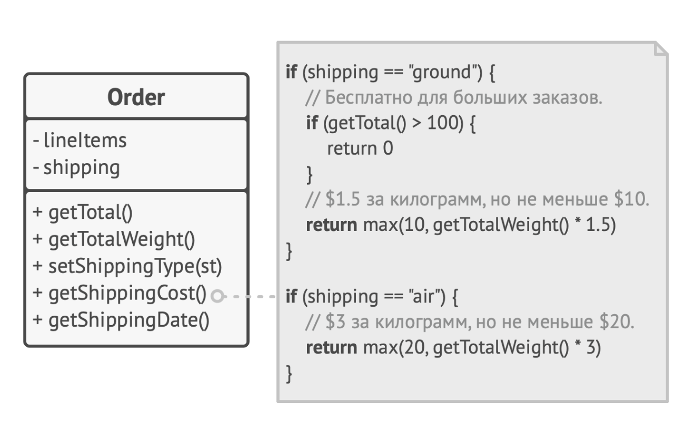

Проблема решается, если вынести расчет в внешний класс, используя общий интерфейс для всех способов доставки

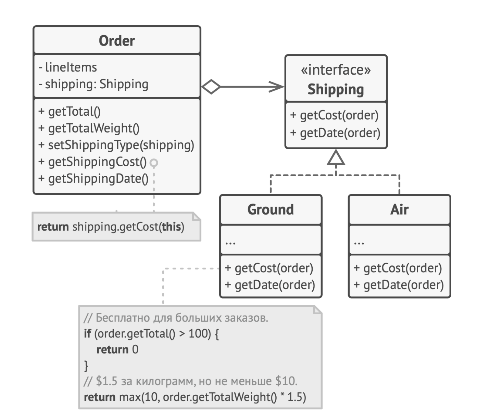

этот прием/паттерн называется ***Стратегия***

### L - подстановки Лискова

> Подклассы должны дополнять, а не замещать поведение базового класса

Подклассы должны быть подставляемы туда, где использовался суперкласс. Принцип подстановки - ряд проверок, которые помогают предсказать совместимость подкласса с кодом, использующим суперкласс. Это конкретный набор инструкций и вот они:

- Типы параметров метода подкласса должны совпадать или быть более абстрактными, чем типы базового класса
- Тип возвращаемого значения метода подкласса должен совпадать или быть подтипом значения базового метода
- Метод не должен выбрасывать исключения, которые не свойственны базовому методу
- Метод не должен ужесточать пред-условия 
    - Если базовый метод принимает int, нельзя объявить, что вход должен быть больше 0, так как клиентский код не учитывал это ограничение
- Метод не должен ослаблять пост-условия  
    - Если базовый метод по завершению закрывает все бодключения к БД, а подкласс оставляет их закрытыми. Тогда клиентский код не обработает это и будет висеть лишняя нагрузка
- Инварианты класса должны оставаться без изменений
    - В идеале, подкласс должен лишь добавлять новые поля и методы, не прикасаясь к базовым
- Подкласс не должен изменять поля приватных полей базового класса

**(В шарпе об этом заботится строгая типизация и статический анализатор.  Он настучит вам по голове, если не будете соблюдать)**

**Пример**:

Плохая иерархия подстановок

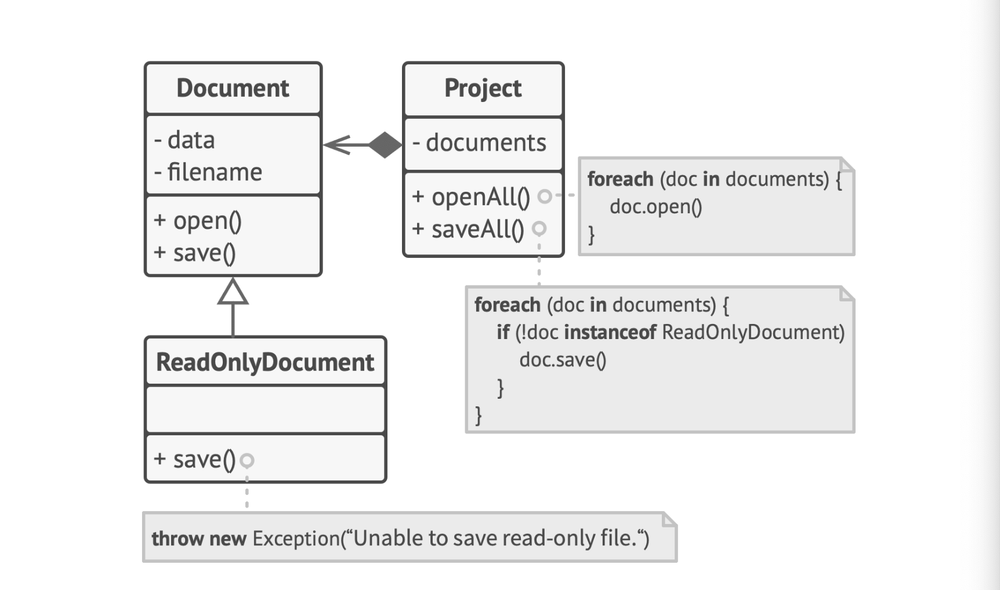

Подкласс ```ReadOnlyDocuments``` выбрасывает новое исключение + нарушается принцип открытости/закрытости, тк клиентский код зависит от конкретного незаменяемого класса

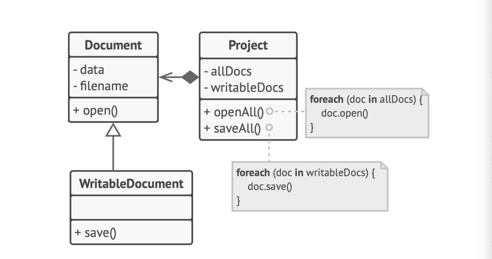

Проблема решается перепроектировав иерархию, следуя принципам подстановки Лискова

### I - разделения интерфейса

> Клиенты не должны зависить от методов, которые они не используют.  

Принцип провозглашает, что интерфейсы должны быть достаточно узкоспециализированны, чтобы классам не приходилось реализовывать избыточное поведение. Наследование позволяет классу иметь только один суперкласс, но на количество интерфейсов ограничений нет. 

**Пример**:
Имеется класс, спроектированный для работы с AWS. Под это и разрабаотывался интерфейс, который содержит прототипы для всех методов. Однако, получившийся интерфейс облачного провайдера слишком широк, а новые классы не способны реализовать весь интерфейс. 

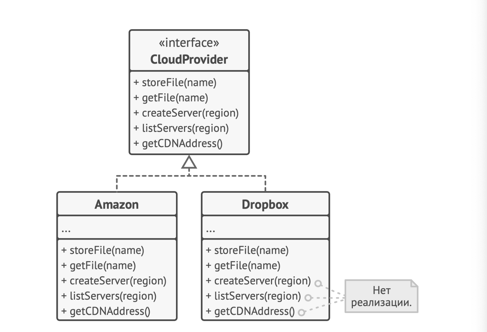

Чтобы не плодить пустые реализации, интерфейс лучше разбить на логические блоки, где не будет навеса из нереалезуемых методов

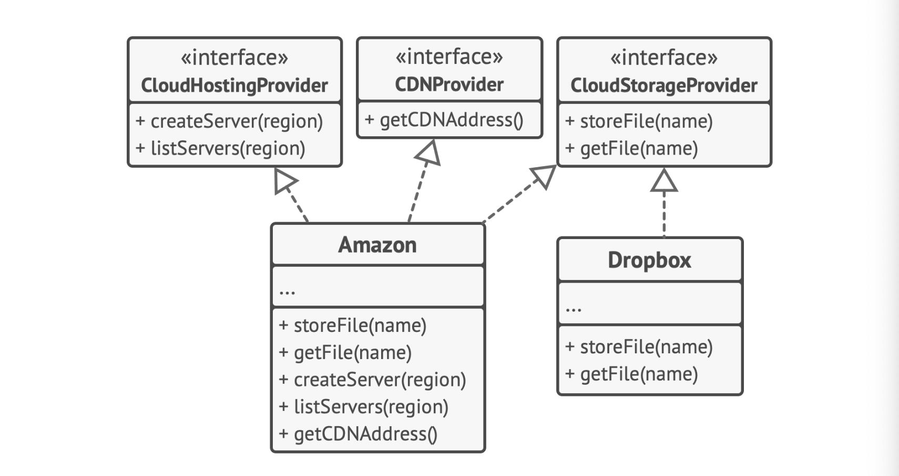

### D - dependency inversion

> Классы верхних уровней не должны зависеть от клас- сов нижних уровней. Оба должны зависеть от абстрак- ций. Абстракции не должны зависеть от деталей. Детали должны зависеть от абстракций.

Этот принцип основывается на разделении классов на два уровня:
- **Классы ниженго уровня** реализуют базовые операции вроде работы с диском, передачи данных по сети и пр.
- **Классы высокого уровня** содержат сложную бизнес-логику и опираются на классы нижнего уровня для более простых операций

Зачастую, сначала реализуются классы нижнего уровня, а потом реализуется высокий. Тогда получается, что бизнес-логика зависит от низкоуровневых классов.  
Принцип инверсии зависимостей предлагает заменить способ проектирования.  Для этого:
- Нужно описать интерфейсы для низкоуровневых классов
- Это уберет сильную зависимость бизнес логики и низкоуровневых классов, заменив ее на мягкую зависимость через интерфейсы
- Низкоуровневый класс станет зависимым от интерфейса, определенного бизнес-логикой

**Пример**
Тут высокоуровневая логика `BudgetReport` сильно зависима от низкоуровневого класса для загрузки в БД `MySQLDatabase`.  Это усложняет внедрение доступа к другим БД. 

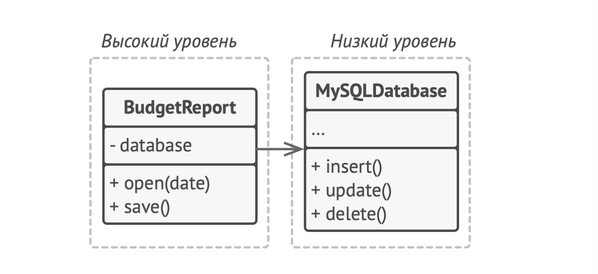

Решением будет внедрить высокоуровневую абстракцию-интерфейс `Database`, которым будет пользоваться бизнес-логика. А низкоуровневые классы будут реализовывать данный интерфейс самостоятельно

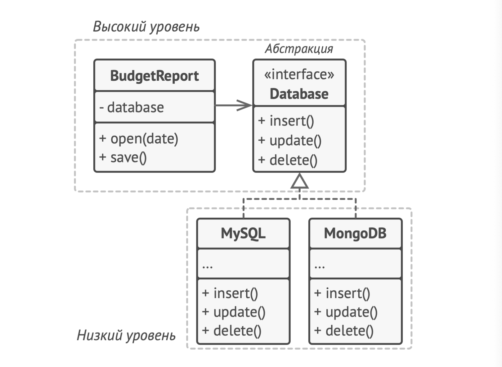

# Порождающие паттерны проектирования

## Фабрика

### Общеие принципы

Мы выдаем ответственность за создание объектов в отдельный фабричный метод, а все объекты должны реализовывать один интерфейс.  Подклассы реализуют логику фабричного метода как им вздумается.  Созданые методом объекты сами реализуют логику своего интерфейса, но пользовательскому коду все равно. 

### Паттерн состоит из

- Продукт определяет общий интерфейс объектов, которые может произвести метод подкласса.  - Конкретные продукты содержат код реализации, но интерфейс общий
- Создатель определяет фабричный метод, который возвращает новые
- объекты продуктов
- 

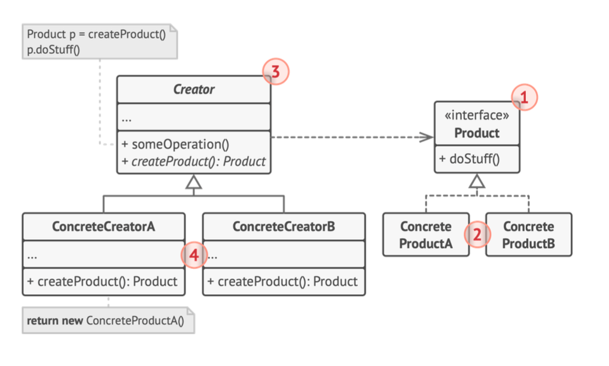

### Код
``` C#
interface IDeliver
{
    public void DoDelivery();
}

abstract class Logistics
{
    public abstract IDeliver CreateTransport();

    public void PlanDelivery()
    {
        IDeliver transport = CreateTransport();
        transport.DoDelivery();
    }
}

class RoadLogistics : Logistics
{
    public override IDeliver CreateTransport()
    {
        return new Truck();
    }
    
}

class SeaLogistics : Logistics
{
    public override IDeliver CreateTransport()
    {
        return new Ship();
    }
}

class Truck : IDeliver
{
    public void DoDelivery()
    {
        Console.WriteLine("I am Trucking");
    }
}

class Ship : IDeliver
{
    public void DoDelivery()
    {
        Console.WriteLine("I am Shipping");
    }
}

internal class Program
{
    public static void Main(string[] args)
    {
        Logistics[] arr = {new RoadLogistics(), new SeaLogistics()};
        foreach (Logistics shipment in arr)
        {
            shipment.PlanDelivery();
        }
    }
}
```

### Реализация

- Привести все продукты к общему интерфейсу
- В классе-фабрике создать пустой фабричный метод,  возвращающий интерфейс
- В коде наследнике фабрики замените все учатки, создающие продукты, на вызов фабричного метода
- Для каждого типа продуктов завести свой подклас и переопределить в нем фабричный метод
- Сделать фабричный метод абстрактным

### Плюсы

+ Избавляет класс от привязки к конкретным классам продуктов
+ Выделяет код производства в одно место
+ Упрощает расширение программы на новые продукты
+ Реализует принцип open/close

### Минусы

- может привести к созданию больших параллельных иерархий классов, так как для каждого класса продукта нужен свой класс создателя

## Абстрактная фабрика

### Общие принципы

Это порождающий паттерн проектирования, который позволяет создать семейства свзанных объектов,  не привязываясь к конкретным классам создаваемых объектов.  
Суть заключается в создании общего интерфейса для фабрик, через который взаимодействует клиент.  Данный интерфейс может создать семейство продуктов. У всех абстрактных продуктов есть свои интерфейсы, а конкретные реализации расширяют их


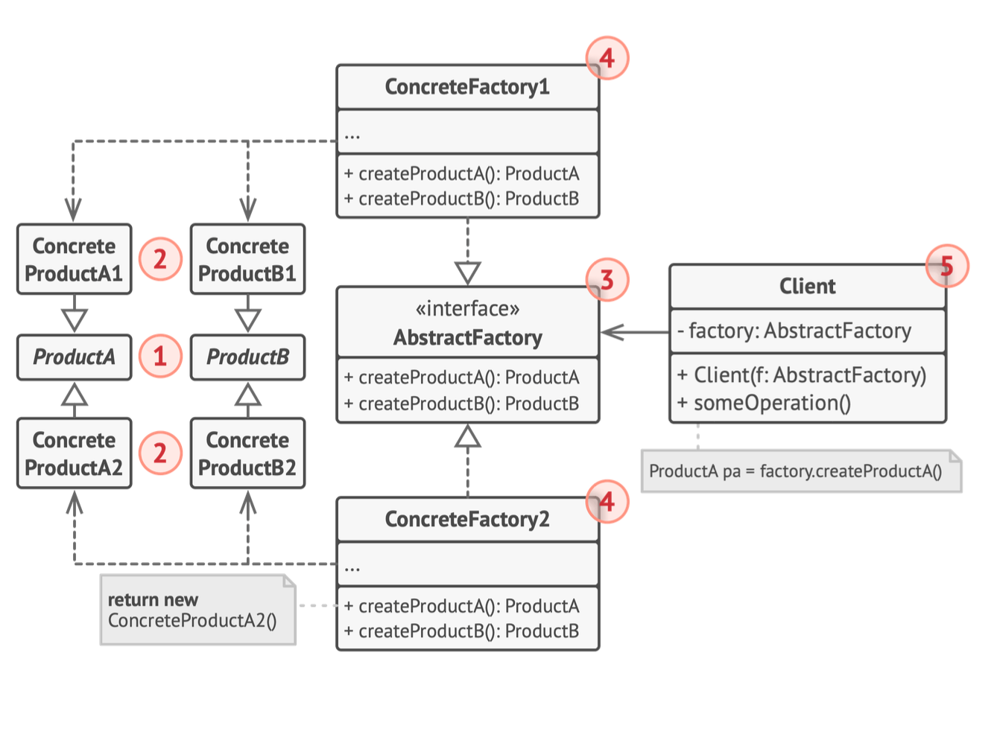


### Паттерн состоит из

1. Абстрактного продукта 
    - Объявляют интиерфейс продуктов, которые связаны друг с другом по смыслу, но выполняют разные функции
1.  Конкретные продукты 
    - Большой набор классов, котоыре относятся к различным абстрактным продуктам, но имеют одинаковые вариации
1.  Абстрактная фабрика
    - Объявляет методы создания различных продуктов
1.  Конкретные фабрики
    - Относятся каждая к своей вариации продуктов

Итого, пользователь обращается к требуемуй конкретной фабрике через абстрактный интерфейс и общается с получеными продуктами через их интерфейсы. Реализация продукта зависит от типа фабрики.  


### Реализация

1. Создать таблицу отношений продуктов к вариациям семейств продуктов

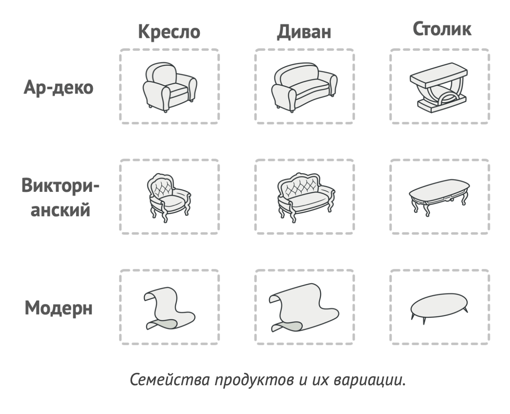

2. Сведите все вариации продуктов к общим интерфейсам  

3. Опрелелить интерфейс абстрактной фабрики. Он должен иметь методы для создания всех продуктов
4. Создать классы фабрик,  реализовав интерфейс абстрактной фабрики. Количество классов == количеству семейств продуктов

5. Добавить в иннициализатор программы код для выбора фабрики. Оно должно передавать фабрику в клиентский код

### Код

**Интерфейсы**

```c#
interface IChair
{
    bool HasLegs();
    void SitOn();
}

interface ICouch
{
    bool FoldsOut();
    void LieOn();
}

interface IAbstractFactory
{
    IChair CreateChair();
    ICouch CreateCouch();
}
```

**Продукты**

```c#
class VintageChair : IChair
{
    public bool HasLegs()
    {
        return true;
    }

    public void SitOn()
    {
        Console.WriteLine("Ow, springy");
    }
}

class ModerChair : IChair
{
    public bool HasLegs()
    {
        return false;
    }

    public void SitOn()
    {
        Console.WriteLine("Can't believe it costs only 999999$");
    } 
}

class VintageCouch : ICouch
{
    public bool FoldsOut()
    {
        return true;
    }

    public void LieOn()
    {
        Console.WriteLine("I can feel the smell");
    }
}

class ModernCouch : ICouch
{
    public bool FoldsOut()
    {
        return false;
    }

    public void LieOn()
    {
        Console.WriteLine("Is that a pipe?");
    }
}
```

**Фабрики**

```c#
class ModernFactory : IAbstractFactory
{
    public IChair CreateChair()
    {
        return new ModerChair();
    }

    public ICouch CreateCouch()
    {
        return new ModernCouch();
    }
}

class VintageFactory : IAbstractFactory
{
    public IChair CreateChair()
    {
        return new VintageChair();
    }

    public ICouch CreateCouch()
    {
        return new VintageCouch();
    }
}
```

### Плюсы

+ гарантирует сочетаемость продуктов
+ Избавляет клиентский код от привязки к конкретным классам
+ Выделяет код производства продуктов в одно место
+ Упрощает добавление новых продуктов
+ Поддерживает принцип open/close

### Минусы

- Усложняет код множеством дополнительных классов
- Требует существования всех типов продукции в каждой вариации

## Строитель

Порождающий паттерн проектирования, который позволяет создавать сложные объекты пошагово. Строитель даёт возможность использовать один и тот же код строительства для получения разных представлений объектов.  

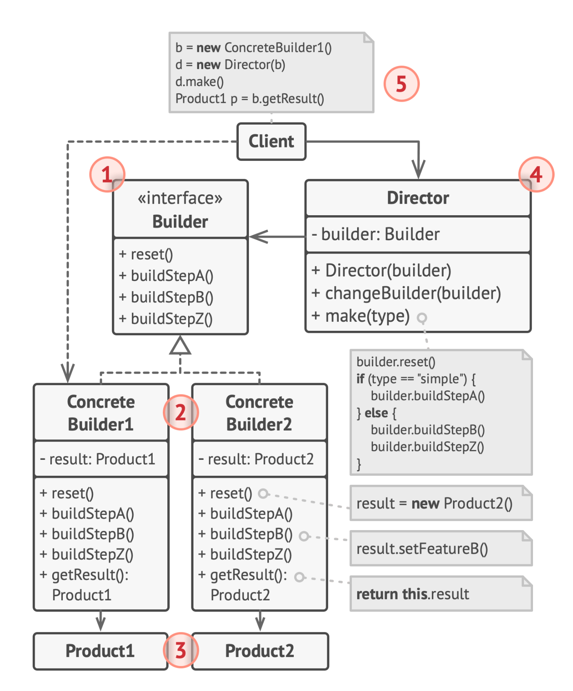

### Общие принципы

Паттерн состоит из иерархии Директор -> Интерфейс Строитель -> Строитель объекта. Директор имеет интерфейс с паттернами и вызывает нужные методы у строителя. У строителя есть метод возврата объекта, который он сконфигурировал после всех команд.

### Паттерн состоит из

1. Директор
    - Имеет в себе шаблоны указаний конструктору для требуемых манипуляций
    - Не передает сконструированный объект клиенту
    - Принимает от клиента конструктора, которым он будет управлять. Он этого зависит выходной объект
2. Строитель
    - У всех конструкторов общий интерфейс
    - Разные конструкторы могут возвращать разные инициализированные объекты
    - Ответственен за возврат клиенту объекта, так как директор не знает про тип возврата строителя

1. Интерфейс строителя объявляет шаги конструирования продуктов, общие для всех  видов строителей
2. Конкретные строители реализуют строительные шаги, каж- дый по-своему. Конкретные строители могут производить разнородные объекты, не имеющие общего интерфейса.
3. Продукт - создаваемый объект. Продукты, сделанные раз- ными строителями, не обязаны иметь общий интерфейс.
4. Директор определяет порядок вызова строительных шагов для производства той или иной конфигурации продуктов.


### Реализация

1. Определить, может ли процесс создания разных классов свестись к одинаковым шагам
2. Описать шаги в интерфейсе строителей
3. Для каждого из продуктов создать по классу-строителю  
    (Метод возврата продукта не обязательно прописан в интерфейсе, так как зависит от объекта, который реализует строитель)
4. Рассмотреть потребность в классе директора
5. Клиент передает строителя директору

### Плюсы

- Позволяет создавать продукты пошагово
- Позволяет использовать одинаковый код для создания различных продуктов
- Изолирует сложный код сборки продукта от основной логики

### Минусы

- Усложняет код программы введением новых классов
- Клиент будет привязан к конкретным классам строителей, так как директор не возвращает результат

## Прототип

Прототип — это порождающий паттерн проектирования, который позволяет копировать объекты, не вдаваясь в подробности их реализации.
Данный паттерн применяется, когда код работает с объектами, подаными извне. 

### Реализация

Для реализации паттерна необходимо
1. Создать интерфейс с одним методом copy()
2. Добавить в классы прототипов альтернативный конструктор, принимающий себя в качестве аргумента
3. Конструктор должен скопировать в себя все поля из поданого объекта

### Плюсы

- позволяет не привязываться к конкретным классам при клонировании
- меньше код инициализатора
- ускоряет создание объектов
- альтернатива созданиюю подклассов, для конструирования сложных объектов

### Минусы

- Сложно клонировать составные объекты со ссылками на другие объекты

## Одиночка

Одиночка - порождающий паттерн проектирования, который гарантирует, что у класса есть только один экземпляр и он предоставляет к себе доступ. Для этого используется принцип перегрузки конструктора. Это часто применяется для работы с БД.

### Реализация

Реализация сводится к скрытию конструктора и созданию публичного статичного метода, который и контроллирует объект. Из какой бы точки кода мы не вызвали этот метод, нам вернется один и тот же объект.

1. Определить статичный метод `GetInstance`, который возвращает единственный экземпляр класса. 
2. Скрыть конструктор объекта, сделать чтобы `GetInstance` был единственным способом получить объект этого класса

### Плюсы

- Гарантирует единственность экземпляра класса
- Предоставляет голобальную точку доступа

### Минусы

- нарушает принцип единственной ответственности класса
- маскирует плохой дизайн
- проблемы мультипоточности
- усложняет unit-testing

# Структурные паттерны

## Адаптер
Адаптер — это структурный паттерн проектирования, который позволяет объектам с несовместимыми интерфейсами работать вместе.